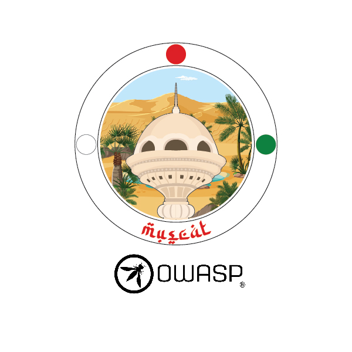

---

layout: col-sidebar
title: OWASP Muscat
tags: muscat chapter oman
region: Asia
meetup-group: muscat-owasp-meetup-group

---

OWASP Muscat Chapter was established in November 2022 by a group of security enthusiasts and experts who prevalently conducts sessions on Web Application Security, Cloud Security, Organization Security, Social Engineering, Digital Regulations, Mobile Vulnerabilities and so forth to make mindfulness connected with software security in the general public. The chapter presents open doors to the software community in contributing to secure application development.

OWASP provides speakers to Institution of Engineers for technical talks related to application security they organize. OWASP also provides speakers to Computer Society in Oman for technical sessions related to application security they organize.

Next Meeting/Event <!-- You should keep this section as it will populate your meetup events -->
---------------------


## Speakers

Would you like to speak on the upcoming OWASP Chapter meet?

### Call for Papers (CFP) is NOW OPEN

Please submit your Profile and the paper abstract here **[OWASP CFP](mailto:ananthakrishnan.krishnakumarsreeja@owasp.org)
